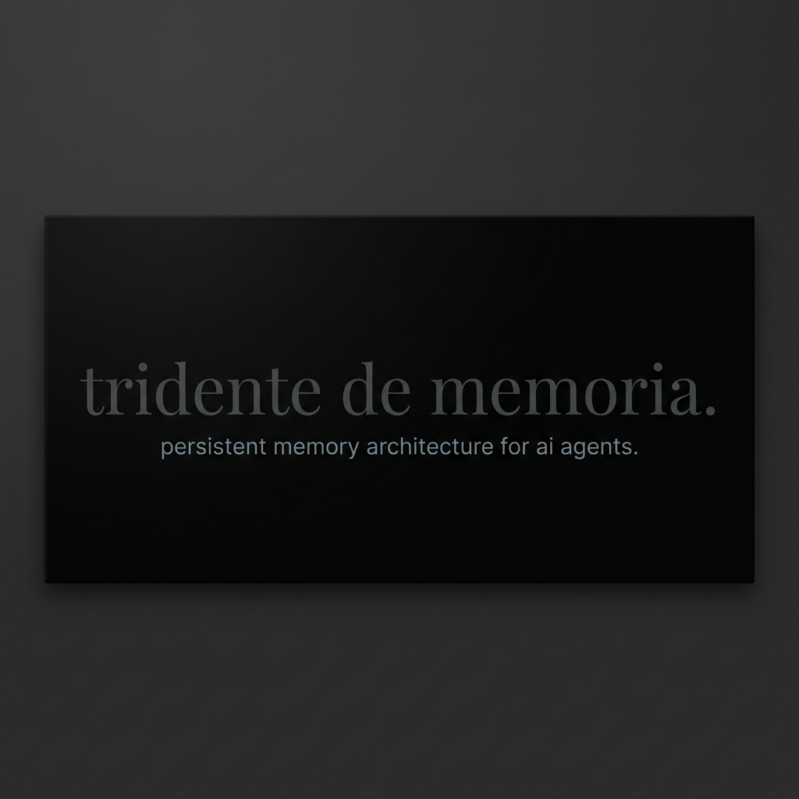

  
    
  
  
  
  
  <h1>🔱 Tridente de Memoria (Memory Trident)</h1>
  
<strong>El sistema definitivo de memoria persistente para Agentes de IA</strong>

  
  
  

---

## ¿Qué es el Tridente de Memoria?

Convierte a tu Inteligencia Artificial de un simple "asistente de código" a un verdadero **Arquitecto de Software** que mantiene el contexto global del proyecto a largo plazo. 

Resuelve el mayor problema del desarrollo asistido por IA: **La pérdida de contexto.**

  <i>"Ningún agente escribirá una sola línea de código a ciegas. Jamás."</i>

---

## Características Principales

| ⚡ Característica | 🎯 Descripción |
| :--- | :--- |
| **🛡️ Anti-Alucinaciones** | Obliga a la IA a leer las reglas y la arquitectura antes de tocar el código. |
| **⚙️ Setup Inteligente (Fase 0)** | Entrevista inicial automática: La IA te pregunta cómo quieres el proyecto y crea la estructura. |
| **📚 Aprendizaje Continuo** | Cada bug resuelto se documenta para que el agente *del futuro* no repita el error. |
| **🔗 Sincronía Total** | Tres archivos markdown interconectados que actúan como un solo cerebro. |

---

## Anatomía del Tridente

El sistema se compone de **3 Archivos Maestros**:

> ### 1️⃣ `gemini.md` (El ADN)
> 🧬 Contiene la identidad, el *stack tecnológico* y las **reglas innegociables** del proyecto.

> ### 2️⃣ `plan_maestro.md` (La Brújula)
> 🗺️ Define la hoja de ruta, los sprints activos, las tareas (TODO) y la **Bitácora de Decisiones**.

> ### 3️⃣ `lecciones_aprendidas.md` (El Escudo)
> 🛡️ Registra las *minas activas*, problemas históricos y bugs. **Para no volver a caer en ellos.**

---

## Instalación en tu Ecosistema

<b>Haz clic aquí para ver las instrucciones</b>

 

1. **Clona** este repositorio o descarga la carpeta `tridente-de-memoria`.
2. **Cópiala** en el directorio global de *skills* de tu entorno (ejemplo: `~/.gemini/config/skills/`).
3. En tu próximo chat, simplemente **activa el sistema** diciéndole a tu IA:
   > *"Inicia un proyecto nuevo usando el Tridente de Memoria"*

**Alternativa Rápida (Recomendada):**  
Simplemente pásale el enlace de este repositorio a tu IA favorita y dile:  
> *"Instala esta skill en tu directorio de memoria."*

---

  
Construida por cyberdark by whoami-labs para la comunidad

  
<b>"Potenciando el desarrollo con Inteligencia Artificial"</b>

  
<i>"la IA potencializa el conocimiento a un 1000 %, donde el límite es tu mente"</i> <b>— Cyberdark</b>

