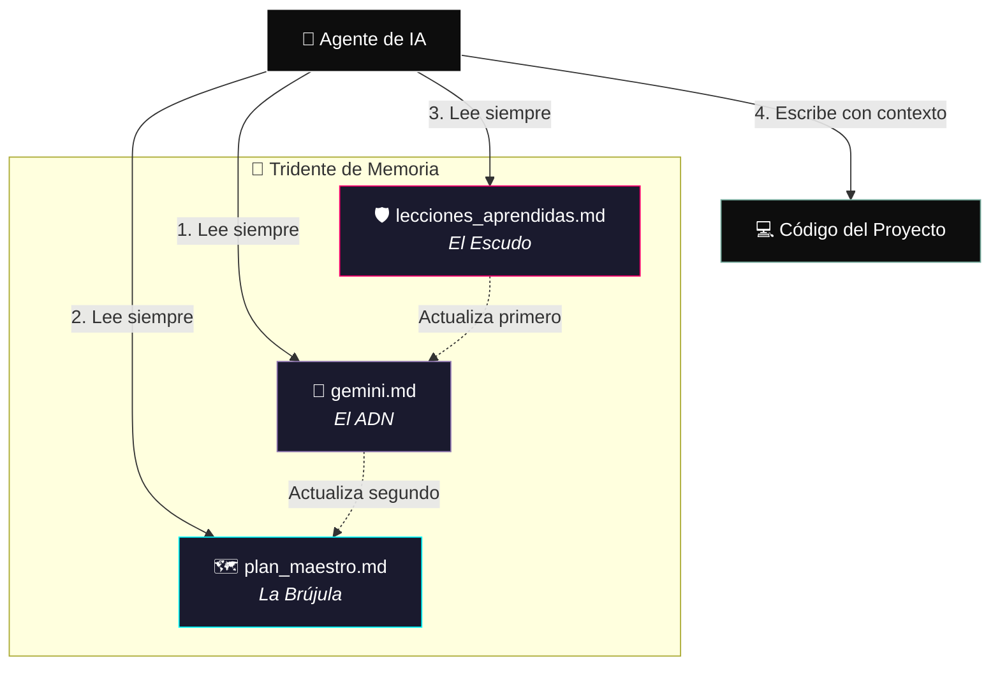
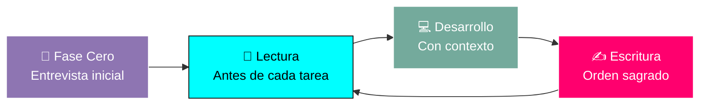

<div align="center">


<br><br>

[](https://whoami-labs.com)
[](https://github.com/Cyberdark-Security/tridente-de-memoria-skill)
[](LICENSE)

# 🔱 Tridente de Memoria

**Arquitectura de memoria persistente para agentes de IA**

*Convierte a tu IA de "asistente de código" en un verdadero Arquitecto de Software.*

[](https://gemini.google.com)
[](https://claude.ai)
[](https://chat.openai.com)
[](https://cursor.com)

[🇬🇧 English version](README_EN.md) · [Documentación del Skill](SKILL.md) · [Guía para Agentes](AGENTS.md)

</div>

---

## Tabla de contenidos

- [El problema](#-el-problema)
- [La solución](#-la-solución)
- [Anatomía del Tridente](#-anatomía-del-tridente)
- [Flujo de trabajo](#-flujo-de-trabajo)
- [Instalación](#-instalación)
- [Inicio rápido](#-inicio-rápido)
- [Herramientas](#️-herramientas-de-automatización)
- [Compatibilidad](#-compatibilidad)

---

## 🎯 El problema

El desarrollo asistido por IA sufre de un fallo crítico: **la pérdida de contexto**.

Cada nueva sesión, cada cambio de modelo o cada reinicio de chat obliga al agente a "adivinar" la arquitectura, las reglas y los bugs ya resueltos. El resultado: código inconsistente, regresiones y alucinaciones.

<div align="center">

> *"Ningún agente escribirá una sola línea de código a ciegas. Jamás."*

</div>

---

## 💡 La solución

El **Tridente de Memoria** es un protocolo de 3 archivos markdown interconectados que actúan como el **cerebro externo** del proyecto. El agente lee antes de actuar, documenta antes de olvidar y sincroniza antes de divergir.

| Característica | Qué hace |
| :--- | :--- |
| 🛡️ **Anti-alucinaciones** | Obliga a leer reglas y arquitectura antes de tocar código |
| ⚙️ **Fase Cero** | Entrevista inicial que genera los 3 archivos con contexto real |
| 📚 **Aprendizaje continuo** | Cada bug resuelto queda documentado para el agente del futuro |
| 🔗 **Sincronía total** | Los 3 archivos se actualizan en orden estricto, como un solo organismo |

---

## 🏗️ Anatomía del Tridente


```mermaid
graph TB
    subgraph TRIDENTE["🔱 Tridente de Memoria"]
        DNA["🧬 gemini.md<br/><i>El ADN</i>"]
        COMPASS["🗺️ plan_maestro.md<br/><i>La Brújula</i>"]
        SHIELD["🛡️ lecciones_aprendidas.md<br/><i>El Escudo</i>"]
    end

    AGENT["🤖 Agente de IA"]
    CODE["💻 Código del Proyecto"]

    AGENT -->|"1. Lee siempre"| DNA
    AGENT -->|"2. Lee siempre"| COMPASS
    AGENT -->|"3. Lee siempre"| SHIELD
    AGENT -->|"4. Escribe con contexto"| CODE

    SHIELD -.->|"Actualiza primero"| DNA
    DNA -.->|"Actualiza segundo"| COMPASS

    style DNA fill:#1a1a2e,stroke:#8E75B2,color:#fff
    style COMPASS fill:#1a1a2e,stroke:#00FFFF,color:#fff
    style SHIELD fill:#1a1a2e,stroke:#FF006E,color:#fff
    style AGENT fill:#0d0d0d,stroke:#fff,color:#fff
    style CODE fill:#0d0d0d,stroke:#74aa9c,color:#fff
```

<table>
<tr>
<td width="33%" valign="top">

### 🧬 `gemini.md`
**El ADN**

Identidad, stack tecnológico y **reglas innegociables**. Es la constitución del proyecto.

</td>
<td width="33%" valign="top">

### 🗺️ `plan_maestro.md`
**La Brújula**

Hoja de ruta, sprints activos, tareas y **bitácora de decisiones**.

</td>
<td width="33%" valign="top">

### 🛡️ `lecciones_aprendidas.md`
**El Escudo**

Minas activas, bugs históricos y trampas técnicas. **Para no caer dos veces.**

</td>
</tr>
</table>

---

## 🔄 Flujo de trabajo


```mermaid
flowchart LR
    A["🚀 Fase Cero<br/>Entrevista inicial"] --> B["📖 Lectura<br/>Antes de cada tarea"]
    B --> C["💻 Desarrollo<br/>Con contexto"]
    C --> D["✍️ Escritura<br/>Orden sagrado"]
    D --> B

    style A fill:#8E75B2,stroke:#fff,color:#fff
    style B fill:#00FFFF,stroke:#000,color:#000
    style C fill:#74aa9c,stroke:#fff,color:#fff
    style D fill:#FF006E,stroke:#fff,color:#fff
```

### El orden sagrado de actualización

Cuando algo cambia en el proyecto, los archivos se actualizan en este orden:

1. **`lecciones_aprendidas.md`** — Documenta el bug o lección técnica
2. **`gemini.md`** — Solo si cambian reglas globales o el stack
3. **`plan_maestro.md`** — Marca tareas completadas y registra la decisión

---

## 📦 Instalación

<details>
<summary><b>Opción A — Instalar como Skill (recomendado)</b></summary>

<br>

Clona este repositorio en el directorio de skills de tu entorno:

| Plataforma | Ruta de instalación |
| :--- | :--- |
| **Cursor** | `~/.cursor/skills/` o `~/.agents/skills/` |
| **Gemini CLI** | `~/.gemini/config/skills/` |
| **Claude Code** | `~/.claude/skills/` |
| **Genérico** | Cualquier carpeta de skills de tu agente |

```bash
git clone https://github.com/Cyberdark-Security/tridente-de-memoria-skill.git
```

Activa el sistema en tu próximo chat:

> *"Inicia un proyecto nuevo usando el Tridente de Memoria"*

</details>

<details>
<summary><b>Opción B — Instalación rápida con IA</b></summary>

<br>

Pásale el enlace del repositorio a tu agente favorito:

> *"Instala esta skill en tu directorio de memoria: https://github.com/Cyberdark-Security/tridente-de-memoria-skill"*

</details>

<details>
<summary><b>Opción C — Solo en un proyecto</b></summary>

<br>

Copia `AGENTS.md` en la raíz de tu proyecto. Los agentes compatibles lo leerán automáticamente y seguirán el protocolo del Tridente.

</details>

---

## ⚡ Inicio rápido

Inicializa los 3 archivos en tu proyecto con una entrevista interactiva:

**Windows (PowerShell)**

```powershell
.\init-tridente.ps1
```

**Linux / macOS / WSL (Bash)**

```bash
chmod +x init-tridente.sh
./init-tridente.sh
```

El script te hará 4 preguntas clave y generará `gemini.md`, `plan_maestro.md` y `lecciones_aprendidas.md` listos para usar.

---

## 🛠️ Herramientas de automatización

| Archivo | Propósito |
| :--- | :--- |
| `init-tridente.ps1` | Inicialización interactiva para Windows |
| `init-tridente.sh` | Inicialización interactiva para Unix |
| `templates/` | Plantillas base de los 3 archivos maestros |
| `SKILL.md` | Protocolo completo para agentes autónomos |
| `AGENTS.md` | Instrucciones de operación (copiar a proyectos) |

---

## 🌐 Compatibilidad

Funciona con cualquier agente de IA que pueda leer archivos markdown del proyecto:

- **Cursor** — vía skills o `AGENTS.md` en la raíz
- **Gemini CLI / Antigravity** — vía directorio de skills
- **Claude Code** — vía skills o instrucciones de proyecto
- **ChatGPT / Copilot** — vía `AGENTS.md` o instrucciones personalizadas
- **Jules, Devin y otros** — vía `AGENTS.md`

---

<div align="center">

<br>

Construido por **[Cyberdark](https://github.com/Cyberdark-Security)** para **[Whoami Labs](https://whoami-labs.com)**

**"Potenciando el desarrollo con Inteligencia Artificial"**

*"La IA potencializa el conocimiento al 1000 %, donde el límite es tu mente."*
— **Cyberdark**

<br>

[](https://github.com/Cyberdark-Security/tridente-de-memoria-skill)

</div>
