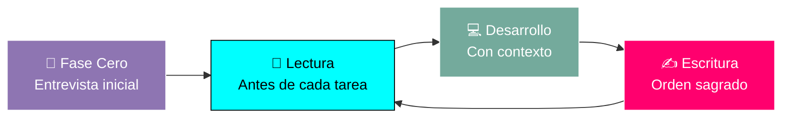

<div align="center">


<br><br>

[](https://whoami-labs.com)
[](https://github.com/Cyberdark-Security/tridente-de-memoria-skill)
[](LICENSE)

# 🔱 Tridente de Memoria

**Arquitectura de memoria persistente para agentes de IA**

*Convierte a tu IA de "asistente de código" en un verdadero Arquitecto de Software.*

[](https://gemini.google.com)
[](https://claude.ai)
[](https://chat.openai.com)
[](https://cursor.com)
[](https://github.com/features/copilot)

[🇬🇧 English version](README_EN.md) · [Documentación del Skill](SKILL.md) · [Guía para Agentes](AGENTS.md) · [Changelog](CHANGELOG.md)

</div>

---

## Tabla de contenidos

- [El problema](#-el-problema)
- [La solución](#-la-solución)
- [Anatomía del Tridente](#-anatomía-del-tridente)
- [Flujo de trabajo](#-flujo-de-trabajo)
- [Instalación](#-instalación)
- [Inicio rápido](#-inicio-rápido)
- [Compatibilidad](#-compatibilidad)
- [Una sola fuente de verdad](#-una-sola-fuente-de-verdad)
- [Verificación con puntaje](#-verificación-con-puntaje)
- [Herramientas del repositorio](#-herramientas-del-repositorio)

---

## 🎯 El problema

El desarrollo asistido por IA sufre de un fallo crítico: **la pérdida de contexto**.

Cada nueva sesión, cada cambio de modelo o cada reinicio de chat obliga al agente a "adivinar" la arquitectura, las reglas y los bugs ya resueltos. El resultado: código inconsistente, regresiones y alucinaciones.

<div align="center">

> *"Ningún agente escribirá una sola línea de código a ciegas. Jamás."*

</div>

---

## 💡 La solución

El **Tridente de Memoria** es un protocolo de 3 archivos markdown interconectados que actúan como el **cerebro externo** del proyecto. El agente lee antes de actuar, documenta antes de olvidar y sincroniza antes de divergir.

| Característica | Qué hace |
| :--- | :--- |
| 🛡️ **Anti-alucinaciones** | Obliga a leer reglas y arquitectura antes de tocar código |
| ⚙️ **Fase Cero** | Entrevista inicial que genera los 3 archivos con contexto real |
| 📚 **Aprendizaje continuo** | Cada bug resuelto queda documentado para el agente del futuro |
| 🔗 **Sincronía total** | Los 3 archivos se actualizan en orden estricto, como un solo organismo |
| 📏 **Medible** | Un validador puntúa de 0 a 100 la salud del Tridente de tu proyecto |

---

## 🏗️ Anatomía del Tridente

<!-- tridente:begin:trident-graph -->

```mermaid
graph TB
    subgraph TRIDENT["🔱 Tridente de Memoria"]
        DNA["🧬 gemini.md<br/><i>El ADN</i>"]
        PLAN["🗺️ plan_maestro.md<br/><i>La Brújula</i>"]
        LESSONS["🛡️ lecciones_aprendidas.md<br/><i>El Escudo</i>"]
    end

    AGENT["🤖 Agente de IA"]
    CODE["💻 Código del Proyecto"]

    AGENT -->|"1. Lee siempre"| DNA
    AGENT -->|"2. Lee siempre"| PLAN
    AGENT -->|"3. Lee siempre"| LESSONS
    AGENT -->|"4. Escribe con contexto"| CODE

    LESSONS -.->|"Actualiza 1.º"| DNA
    DNA -.->|"Actualiza 2.º"| PLAN

    style DNA fill:#1a1a2e,stroke:#8E75B2,color:#fff
    style PLAN fill:#1a1a2e,stroke:#00FFFF,color:#fff
    style LESSONS fill:#1a1a2e,stroke:#FF006E,color:#fff
    style AGENT fill:#0d0d0d,stroke:#fff,color:#fff
    style CODE fill:#0d0d0d,stroke:#74aa9c,color:#fff
```
<!-- tridente:end:trident-graph -->

<!-- tridente:begin:trident-table -->
| Archivo | Rol | Contenido |
| :--- | :--- | :--- |
| `gemini.md` | 🧬 El ADN | Identidad, stack tecnológico, reglas innegociables y arquitectura del proyecto. |
| `plan_maestro.md` | 🗺️ La Brújula | Roadmap, hito actual, sprint activo, backlog y bitácora de decisiones. |
| `lecciones_aprendidas.md` | 🛡️ El Escudo | Minas activas, bugs históricos y trampas técnicas ya pagadas. |
<!-- tridente:end:trident-table -->

<!-- tridente:begin:trident-cards -->
<table>
<tr>
<td width="33%" valign="top">

### 🧬 `gemini.md`
**El ADN**

Identidad, stack tecnológico, reglas innegociables y arquitectura del proyecto.

</td>
<td width="33%" valign="top">

### 🗺️ `plan_maestro.md`
**La Brújula**

Roadmap, hito actual, sprint activo, backlog y bitácora de decisiones.

</td>
<td width="33%" valign="top">

### 🛡️ `lecciones_aprendidas.md`
**El Escudo**

Minas activas, bugs históricos y trampas técnicas ya pagadas.

</td>
</tr>
</table>
<!-- tridente:end:trident-cards -->

---

## 🔄 Flujo de trabajo


```mermaid
flowchart LR
    A["🚀 Fase Cero<br/>Entrevista inicial"] --> B["📖 Lectura<br/>Antes de cada tarea"]
    B --> C["💻 Desarrollo<br/>Con contexto"]
    C --> D["✍️ Escritura<br/>Orden sagrado"]
    D --> B

    style A fill:#8E75B2,stroke:#fff,color:#fff
    style B fill:#00FFFF,stroke:#000,color:#000
    style C fill:#74aa9c,stroke:#fff,color:#fff
    style D fill:#FF006E,stroke:#fff,color:#fff
```

### Antes de programar — se lee en este orden

<!-- tridente:begin:read-order -->
1. **`gemini.md`** — Stack, reglas innegociables, arquitectura
2. **`plan_maestro.md`** — Hito actual, tareas activas, bitácora de decisiones
3. **`lecciones_aprendidas.md`** — Minas activas, bugs conocidos, lecciones pasadas
<!-- tridente:end:read-order -->

### Al terminar — se escribe en el orden sagrado

<!-- tridente:begin:write-order -->
1. **`lecciones_aprendidas.md`** — Minas activas, bugs históricos y trampas técnicas ya pagadas.
2. **`gemini.md`** — Identidad, stack tecnológico, reglas innegociables y arquitectura del proyecto.
3. **`plan_maestro.md`** — Roadmap, hito actual, sprint activo, backlog y bitácora de decisiones.
<!-- tridente:end:write-order -->

La lección va primero porque el dolor se documenta en caliente; el plan va al final porque referencia a los otros dos.

### Formato de fecha

<!-- tridente:begin:date-format -->
Todas las fechas de los archivos maestros usan **YYYY-MM-DD** (ISO 8601), por ejemplo `2026-09-17`. ISO 8601 es ordenable lexicográficamente y no ambiguo entre locales. DD/MM/AAAA rompe el orden de la bitácora y se confunde con MM/DD/AAAA.
<!-- tridente:end:date-format -->

---

## 📦 Instalación

<details>
<summary><b>Opción A — Instalar como Skill (recomendado)</b></summary>

<br>

El nombre del directorio de destino importa: debe coincidir con el campo `name` del frontmatter de `SKILL.md`.

```bash
git clone https://github.com/Cyberdark-Security/tridente-de-memoria-skill.git \
  ~/.claude/skills/tridente-de-memoria
```

<!-- tridente:begin:install-table -->
| Plataforma | Ruta de instalación |
| :--- | :--- |
| **Claude Code** | `~/.claude/skills/tridente-de-memoria` |
| **Cursor** | `~/.cursor/skills/tridente-de-memoria` |
| **Gemini CLI** | `~/.gemini/skills/tridente-de-memoria` |
| **Genérico (AGENTS skills)** | `~/.agents/skills/tridente-de-memoria` |
<!-- tridente:end:install-table -->

Activa el sistema en tu próximo chat:

> *"Inicia un proyecto nuevo usando el Tridente de Memoria"*

</details>

<details>
<summary><b>Opción B — Instalación rápida con IA</b></summary>

<br>

Pásale el enlace del repositorio a tu agente favorito:

> *"Instala esta skill en tu directorio de skills: https://github.com/Cyberdark-Security/tridente-de-memoria-skill"*

</details>

<details>
<summary><b>Opción C — Sólo en un proyecto</b></summary>

<br>

Copia `AGENTS.md` en la raíz de tu proyecto. Es el archivo que leen Codex, Cursor, Jules, Devin y cualquier agente que siga la convención `AGENTS.md`.

Para el resto de herramientas, `init-tridente.sh --adapters all` deja además un puntero en la ruta que cada una espera. Todos reenvían a `AGENTS.md`; ninguno duplica el protocolo.

</details>

---

## ⚡ Inicio rápido

**Linux / macOS / WSL / Git Bash**

```bash
bash init-tridente.sh
```

**Windows (PowerShell)**

```powershell
powershell -ExecutionPolicy Bypass -File .\init-tridente.ps1
```

<!-- tridente:begin:quickstart-result -->
El script hace 4 preguntas y genera `gemini.md`, `plan_maestro.md` y `lecciones_aprendidas.md` poblados, más `AGENTS.md` y los punteros de cada herramienta.
<!-- tridente:end:quickstart-result -->

### Modo no interactivo (CI, scripts, agentes)

```bash
bash init-tridente.sh \
  --dir ./mi-proyecto \
  --goal "API de pagos con conciliación automática" \
  --stack "Go 1.23 + PostgreSQL 16 + Docker" \
  --rules "Sin ORM; errores siempre envueltos con contexto" \
  --milestone "MVP con login y CRUD de usuarios" \
  --adapters claude,cursor,copilot \
  --yes
```

```bash
bash init-tridente.sh --help
```

Ambos scripts producen **archivos de contenido idéntico** (la comparación normaliza el fin de línea propio de cada plataforma); hay una prueba automatizada que lo verifica en cada commit.

---

## 🌐 Compatibilidad

`AGENTS.md` es el archivo que leen casi todos los agentes modernos. Para el resto, el repositorio genera un puntero en la ruta que cada herramienta espera.

<!-- tridente:begin:compat-table -->
| Herramienta | Archivo que lee | Mecanismo |
| :--- | :--- | :--- |
| OpenAI Codex | `AGENTS.md` | Nativo |
| Cursor | `.cursor/rules/tridente.mdc` | Adaptador generado |
| Claude Code | `CLAUDE.md` | Adaptador generado |
| Gemini CLI / Antigravity | `.gemini/settings.json` | Adaptador generado |
| GitHub Copilot | `.github/copilot-instructions.md` | Adaptador generado |
| Windsurf | `.windsurfrules` | Adaptador generado |
| Roo Code | `.roo/rules/tridente.md` | Adaptador generado |
| JetBrains Junie | `.junie/guidelines.md` | Adaptador generado |
| Amazon Q Developer | `.amazonq/rules/tridente.md` | Adaptador generado |
| Firebase Studio / Project IDX | `.idx/airules.md` | Adaptador generado |
| Aider | `CONVENTIONS.md` | Adaptador generado — requiere `aider --read CONVENTIONS.md` o `read:` en `.aider.conf.yml` |
| Jules / Devin / OpenHands y otros | `AGENTS.md` | Nativo |
| Devin Desktop (ex-Windsurf) | `.devin/rules/tridente.md` | Adaptador generado |
| Cline | `.clinerules/tridente.md` | Adaptador generado |
<!-- tridente:end:compat-table -->

<!-- tridente:begin:gemini-note -->
> **Nota sobre Gemini:** no se genera `GEMINI.md` en la raíz. En Windows y macOS el sistema de archivos no distingue mayúsculas, así que `GEMINI.md` y `gemini.md` (el ADN) serían **el mismo archivo**. En su lugar se configura `.gemini/settings.json` para que Gemini CLI cargue `AGENTS.md` y `gemini.md` como contexto.
<!-- tridente:end:gemini-note -->

---

## 🧩 Una sola fuente de verdad

El motivo por el que la documentación del Tridente se desincronizaba era simple: el protocolo estaba escrito siete veces. Ahora está escrito una:

```
protocol/tridente.spec.json      ← se edita esto
        │
        └── node scripts/sync.mjs
                │
                ├── AGENTS.md              ├── templates/*.md
                ├── docs/AGENTS.en.md      ├── CLAUDE.md
                ├── SKILL.md               ├── .cursor/rules/tridente.mdc
                ├── bloques de los README  └── … un puntero por herramienta
```

Todo archivo generado empieza con una cabecera `NO EDITAR A MANO`, y CI rechaza cualquier PR en el que `node scripts/sync.mjs --check` falle. **La deriva deja de ser posible por construcción, no por disciplina.**

Ver [`CONTRIBUTING.md`](CONTRIBUTING.md) para el flujo completo.

---

## 📏 Verificación con puntaje

```bash
node scripts/validate.mjs                     # audita este repositorio
node scripts/validate.mjs --project .         # audita el Tridente de tu proyecto
node scripts/validate.mjs --project . --json  # salida legible por máquina
node scripts/validate.mjs --project . --strict # exige también el umbral
```

```
████████████████████ 100%  SSOT y sincronización  [peso 28]
████████████████████ 100%  Compatibilidad multi-agente  [peso 18]
████████████████████ 100%  Integridad documental  [peso 14]
████████████████████ 100%  Scripts de inicialización  [peso 18]
████████████████████ 100%  Higiene del repositorio  [peso 8]
████████████████████ 100%  Pruebas y CI  [peso 14]

✅ PUNTAJE: 100.0 / 100   (umbral 95)
```

Los dos modos tienen semánticas distintas a propósito:

- **Modo repositorio** — puerta de calidad. Sale 0 si el puntaje alcanza el umbral (95 por defecto).
- **Modo proyecto** — diagnóstico. Sale 0 si la **estructura** está íntegra, aunque el contenido esté a medio rellenar. Un Tridente recién creado tiene la estructura perfecta y el ADN con huecos: eso es progreso pendiente, no un fallo, y por eso no llega a 100 hasta que lo rellenas. **El puntaje es tu barra de progreso**; sube conforme defines arquitectura, estándares y capas del stack. Con `--strict` se aplica también el umbral.

En modo proyecto se comprueba que los 3 archivos existan, tengan sus secciones, estén poblados, usen fechas ISO, incluyan todos los campos en cada entrada de bitácora y lección, y se referencien entre sí.

---

## 🛠️ Herramientas del repositorio

| Ruta | Propósito |
| :--- | :--- |
| `protocol/tridente.spec.json` | **Fuente única de verdad** del protocolo |
| `scripts/sync.mjs` | Regenera toda la documentación derivada (`--check` para CI) |
| `scripts/validate.mjs` | Auditoría con puntaje 0–100 |
| `init-tridente.sh` | Fase Cero en Unix, macOS, WSL y Git Bash |
| `init-tridente.ps1` | Fase Cero en Windows PowerShell 5.1 y PowerShell 7+ |
| `templates/` | Las 3 plantillas con tokens `{{...}}` |
| `AGENTS.md` | Instrucciones operativas (lo leen los agentes) |
| `SKILL.md` | Manifiesto del skill para Claude Code y Cursor |
| `tests/` | Suite con `node --test`, incluida la paridad Bash ↔ PowerShell |

Sin dependencias: sólo Node ≥ 18.18 para el tooling. El protocolo en sí es markdown puro.

---

<div align="center">

<br>

Construido por **[Cyberdark](https://github.com/Cyberdark-Security)** para **[Whoami Labs](https://whoami-labs.com)**

**"Potenciando el desarrollo con Inteligencia Artificial"**

*"La IA potencializa el conocimiento al 1000 %, donde el límite es tu mente."*
— **Cyberdark**

<br>

[](https://github.com/Cyberdark-Security/tridente-de-memoria-skill)

</div>
