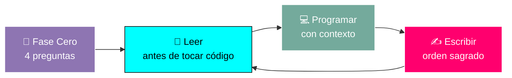

<div align="center">


<br><br>

[](https://whoami-labs.com)
[](https://github.com/Cyberdark-Security/tridente-de-memoria-skill)
[](LICENSE)

# 🔱 Tridente de Memoria

**Memoria persistente para agentes de IA. Tres archivos markdown. Nada más.**

[🇬🇧 English](README_EN.md) · [Protocolo](AGENTS.md) · [Skill](SKILL.md) · [Changelog](CHANGELOG.md)

</div>

---

## El problema

Cada sesión nueva, cada cambio de modelo, cada reinicio del chat: el agente
arranca a ciegas. Vuelve a adivinar la arquitectura, se salta las reglas del
proyecto y reintroduce bugs que ya habías pagado una vez.

## La solución

Tres archivos markdown en la raíz del proyecto, que el agente lee antes de
escribir código y actualiza al terminar.

| Archivo | Rol | Contenido |
| :--- | :--- | :--- |
| `gemini.md` | 🧬 El ADN | Identidad, stack tecnológico, reglas innegociables y arquitectura. |
| `plan_maestro.md` | 🗺️ La Brújula | Roadmap, hito actual, sprint activo, backlog y bitácora de decisiones. |
| `lecciones_aprendidas.md` | 🛡️ El Escudo | Minas activas, bugs históricos y trampas técnicas ya pagadas. |

Un cuarto archivo, `AGENTS.md`, contiene el protocolo: es lo que el agente lee
para saber que los otros tres existen y cómo usarlos.

---

## El ciclo


```mermaid
flowchart LR
    A["🚀 Fase Cero<br/>4 preguntas"] --> B["📖 Leer<br/>antes de tocar código"]
    B --> C["💻 Programar<br/>con contexto"]
    C --> D["✍️ Escribir<br/>orden sagrado"]
    D --> B

    style A fill:#8E75B2,stroke:#fff,color:#fff
    style B fill:#00FFFF,stroke:#000,color:#000
    style C fill:#74aa9c,stroke:#fff,color:#fff
    style D fill:#FF006E,stroke:#fff,color:#fff
```

**Leer** — `gemini.md` → `plan_maestro.md` → `lecciones_aprendidas.md`

**Escribir** — `lecciones_aprendidas.md` → `gemini.md` → `plan_maestro.md`

La lección va primero porque el dolor se documenta en caliente. El plan va al
final porque referencia a los otros dos.

Todas las fechas en **YYYY-MM-DD** (ISO 8601): ordenable alfabéticamente y sin
ambigüedad entre locales.

---

## Instalación

### La forma fácil: que lo instale tu IA

Abre tu proyecto en Claude Code, Codex, Cursor, Antigravity o el agente que uses,
y pégale esto:

> Instala el Tridente de Memoria en este proyecto siguiendo
> https://raw.githubusercontent.com/Cyberdark-Security/tridente-de-memoria-skill/main/AGENTS.md
> — hazme las preguntas de la Fase Cero una por una.

Te hará cuatro preguntas sobre tu proyecto y escribirá los archivos. No hay nada
que descargar, ni script que ejecutar, ni terminal que abrir.

### La forma manual

Copia [`AGENTS.md`](AGENTS.md) a la raíz de tu proyecto. Ya está. La mayoría de
agentes —Codex, Cursor, Copilot, Jules, Devin, OpenHands, Antigravity— lo leen
sin configuración.

Si usas Claude Code, añade además un `CLAUDE.md` con una línea:

```markdown
@AGENTS.md
```

Luego pídele a tu agente: *"inicia el Tridente en este proyecto"*.

### Cómo queda

Mira [`EJEMPLO.md`](EJEMPLO.md): un proyecto con los tres archivos ya vividos,
con decisiones tomadas, bugs documentados y una mina activa.

### Como skill permanente

```bash
git clone https://github.com/Cyberdark-Security/tridente-de-memoria-skill \
  ~/.claude/skills/tridente-de-memoria
```

Rutas para otras herramientas en [`SKILL.md`](SKILL.md). El nombre del
directorio debe ser `tridente-de-memoria`.

---

## Qué hay en este repositorio

| Ruta | Qué es |
| :--- | :--- |
| [`AGENTS.md`](AGENTS.md) | El protocolo. La autoridad; todo lo demás apunta aquí. |
| [`templates/`](templates/) | Las tres plantillas con tokens `{{...}}`. |
| [`EJEMPLO.md`](EJEMPLO.md) | Cómo se ve un proyecto real con el Tridente puesto. |
| [`SKILL.md`](SKILL.md) | Manifiesto para instalarlo como skill. |
| [`CLAUDE.md`](CLAUDE.md) | Puntero de seis líneas para Claude Code. |
| [`docs/AGENTS.en.md`](docs/AGENTS.en.md) | El protocolo en inglés. |

Markdown puro. Sin dependencias, sin build, sin scripts.

### La regla que mantiene esto pequeño

Este repositorio pasó por una etapa en la que el andamiaje pesaba veinte veces
más que el producto: un generador, un validador con puntaje, catorce punteros de
herramienta, dos instaladores y 1.475 líneas de pruebas. Se borró entero en la
v3.0.0 ([changelog](CHANGELOG.md)).

Antes de añadir cualquier cosa aquí, la pregunta es: **¿esto lo necesita quien
usa el Tridente, o sólo quien mantiene el repositorio?** Si es lo segundo, no
entra.

---

<div align="center">

<br>

Construido por **[Cyberdark](https://github.com/Cyberdark-Security)** para **[Whoami Labs](https://whoami-labs.com)**

*"La IA potencializa el conocimiento al 1000 %, donde el límite es tu mente."*
— **Cyberdark**

<br>

[](https://github.com/Cyberdark-Security/tridente-de-memoria-skill)

</div>
