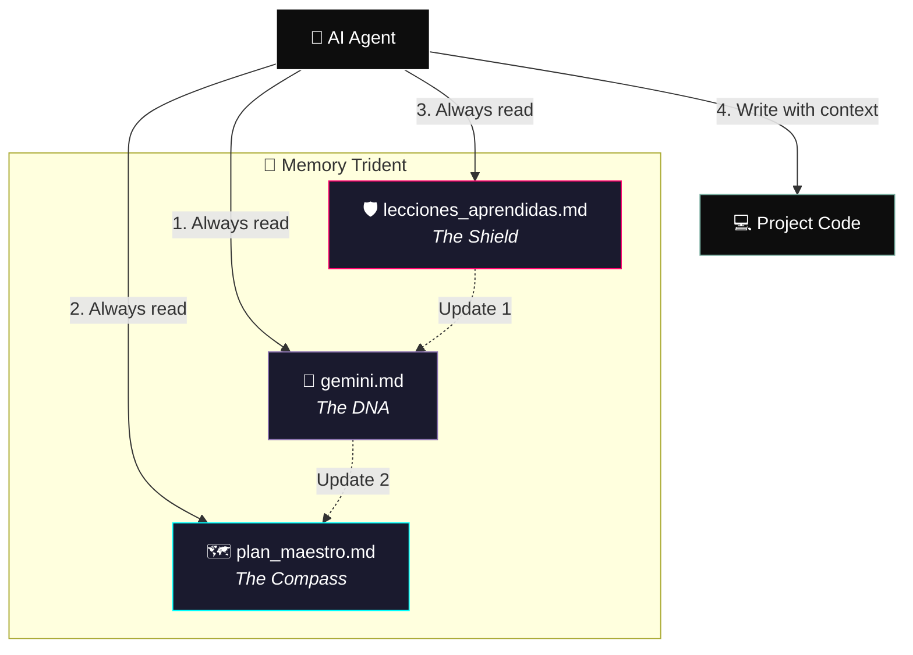

<div align="center">


<br><br>

[](https://whoami-labs.com)
[](https://github.com/Cyberdark-Security/tridente-de-memoria-skill)
[](LICENSE)

# 🔱 Memory Trident

**Persistent memory architecture for AI agents**

*Turn your AI from a "code assistant" into a true Software Architect.*

[](https://gemini.google.com)
[](https://claude.ai)
[](https://chat.openai.com)
[](https://cursor.com)
[](https://github.com/features/copilot)

[🇪🇸 Versión en español](README.md) · [Skill documentation](SKILL.md) · [Agent guide](docs/AGENTS.en.md) · [Changelog](CHANGELOG.md)

</div>

---

## Table of contents

- [The problem](#-the-problem)
- [The solution](#-the-solution)
- [Anatomy of the Trident](#-anatomy-of-the-trident)
- [Workflow](#-workflow)
- [Installation](#-installation)
- [Quick start](#-quick-start)
- [Compatibility](#-compatibility)
- [Single source of truth](#-single-source-of-truth)
- [Scored verification](#-scored-verification)
- [Repository tooling](#-repository-tooling)

---

## 🎯 The problem

AI-assisted development suffers from a critical flaw: **context loss**.

Every new session, model switch, or chat restart forces the agent to "guess" the architecture, the rules, and the bugs already fixed. The result: inconsistent code, regressions, and hallucinations.

<div align="center">

> *"No agent will ever write a single line of code blindly. Ever."*

</div>

---

## 💡 The solution

The **Memory Trident** is a protocol of 3 interconnected markdown files that act as the project's **external brain**. The agent reads before acting, documents before forgetting, and syncs before diverging.

| Feature | What it does |
| :--- | :--- |
| 🛡️ **Anti-hallucination** | Forces reading rules and architecture before touching code |
| ⚙️ **Phase Zero** | Initial interview that generates the 3 files with real context |
| 📚 **Continuous learning** | Every solved bug is documented for the future agent |
| 🔗 **Total sync** | The 3 files update in strict order, as a single organism |
| 📏 **Measurable** | A validator scores your project's Trident from 0 to 100 |

---

## 🏗️ Anatomy of the Trident

<!-- tridente:begin:trident-graph-en -->

<!-- tridente:end:trident-graph-en -->

<!-- tridente:begin:trident-table-en -->
| File | Role | Contents |
| :--- | :--- | :--- |
| `gemini.md` | 🧬 The DNA | Identity, tech stack, non-negotiable rules and project architecture. |
| `plan_maestro.md` | 🗺️ The Compass | Roadmap, current milestone, active sprint, backlog and decision log. |
| `lecciones_aprendidas.md` | 🛡️ The Shield | Active mines, historical bugs and technical traps already paid for. |
<!-- tridente:end:trident-table-en -->

<!-- tridente:begin:trident-cards-en -->
<table>
<tr>
<td width="33%" valign="top">

### 🧬 `gemini.md`
**The DNA**

Identity, tech stack, non-negotiable rules and project architecture.

</td>
<td width="33%" valign="top">

### 🗺️ `plan_maestro.md`
**The Compass**

Roadmap, current milestone, active sprint, backlog and decision log.

</td>
<td width="33%" valign="top">

### 🛡️ `lecciones_aprendidas.md`
**The Shield**

Active mines, historical bugs and technical traps already paid for.

</td>
</tr>
</table>
<!-- tridente:end:trident-cards-en -->

> File names are Spanish because that is the canonical protocol. Identify them by role, not by name — aliases such as `PROJECT_DNA.md` or `LESSONS_LEARNED.md` are recognised.

---

## 🔄 Workflow


### When done — write in the sacred order

<!-- tridente:begin:write-order-en -->
1. **`lecciones_aprendidas.md`** — Active mines, historical bugs and technical traps already paid for.
2. **`gemini.md`** — Identity, tech stack, non-negotiable rules and project architecture.
3. **`plan_maestro.md`** — Roadmap, current milestone, active sprint, backlog and decision log.
<!-- tridente:end:write-order-en -->

The lesson comes first because pain is documented while it is still hot; the plan comes last because it references the other two.

### Date format

<!-- tridente:begin:date-format-en -->
All dates in the master files use **YYYY-MM-DD** (ISO 8601), e.g. `2026-09-17`.
<!-- tridente:end:date-format-en -->

---

## 📦 Installation

<details>
<summary><b>Option A — Install as a skill (recommended)</b></summary>

<br>

The target directory name matters: it must match the `name` field in `SKILL.md`'s frontmatter.

```bash
git clone https://github.com/Cyberdark-Security/tridente-de-memoria-skill.git \
  ~/.claude/skills/tridente-de-memoria
```

<!-- tridente:begin:install-table-en -->
| Platform | Install path |
| :--- | :--- |
| **Claude Code** | `~/.claude/skills/tridente-de-memoria` |
| **Cursor** | `~/.cursor/skills/tridente-de-memoria` |
| **Gemini CLI** | `~/.gemini/skills/tridente-de-memoria` |
| **Genérico (AGENTS skills)** | `~/.agents/skills/tridente-de-memoria` |
<!-- tridente:end:install-table-en -->

Activate it in your next chat:

> *"Start a new project using the Memory Trident"*

</details>

<details>
<summary><b>Option B — Quick install via AI</b></summary>

<br>

> *"Install this skill in your skills directory: https://github.com/Cyberdark-Security/tridente-de-memoria-skill"*

</details>

<details>
<summary><b>Option C — Project only</b></summary>

<br>

Copy `AGENTS.md` to your project root. That is the file read by Codex, Cursor, Jules, Devin, and any agent following the `AGENTS.md` convention.

For every other tool, `init-tridente.sh --adapters all` also drops a pointer at the path each one expects. They all forward to `AGENTS.md`; none of them duplicates the protocol.

</details>

---

## ⚡ Quick start

**Linux / macOS / WSL / Git Bash**

```bash
bash init-tridente.sh
```

**Windows (PowerShell)**

```powershell
powershell -ExecutionPolicy Bypass -File .\init-tridente.ps1
```

### Non-interactive mode (CI, scripts, agents)

```bash
bash init-tridente.sh \
  --dir ./my-project \
  --goal "Payments API with automatic reconciliation" \
  --stack "Go 1.23 + PostgreSQL 16 + Docker" \
  --rules "No ORM; always wrap errors with context" \
  --milestone "MVP with login and user CRUD" \
  --adapters claude,cursor,copilot \
  --yes
```

```bash
bash init-tridente.sh --help
```

Both scripts produce **files with identical content** (the comparison normalises each platform’s line endings); an automated test verifies this on every commit.

---

## 🌐 Compatibility

`AGENTS.md` is the file almost every modern agent reads. For the rest, the repository generates a pointer at the path each tool expects.

<!-- tridente:begin:compat-table-en -->
| Tool | File it reads | Mechanism |
| :--- | :--- | :--- |
| OpenAI Codex | `AGENTS.md` | Native |
| Cursor | `.cursor/rules/tridente.mdc` | Generated adapter |
| Claude Code | `CLAUDE.md` | Generated adapter |
| Gemini CLI / Antigravity | `.gemini/settings.json` | Generated adapter |
| GitHub Copilot | `.github/copilot-instructions.md` | Generated adapter |
| Windsurf | `.windsurfrules` | Generated adapter |
| Roo Code | `.roo/rules/tridente.md` | Generated adapter |
| JetBrains Junie | `.junie/guidelines.md` | Generated adapter |
| Amazon Q Developer | `.amazonq/rules/tridente.md` | Generated adapter |
| Firebase Studio / Project IDX | `.idx/airules.md` | Generated adapter |
| Aider | `CONVENTIONS.md` | Generated adapter — needs `aider --read CONVENTIONS.md` or `read:` in `.aider.conf.yml` |
| Jules / Devin / OpenHands y otros | `AGENTS.md` | Native |
| Devin Desktop (ex-Windsurf) | `.devin/rules/tridente.md` | Generated adapter |
| Cline | `.clinerules/tridente.md` | Generated adapter |
<!-- tridente:end:compat-table-en -->

<!-- tridente:begin:gemini-note-en -->
> **On Gemini:** no `GEMINI.md` is generated at the root. On Windows and macOS the filesystem is case-insensitive, so `GEMINI.md` and `gemini.md` (the DNA file) would be **the same file**. Instead, `.gemini/settings.json` tells Gemini CLI to load `AGENTS.md` and `gemini.md` as context.
<!-- tridente:end:gemini-note-en -->

---

## 🧩 Single source of truth

The reason the Trident's own documentation kept drifting was simple: the protocol was written seven times. Now it is written once:

```
protocol/tridente.spec.json      ← edit this
        │
        └── node scripts/sync.mjs
                │
                ├── AGENTS.md              ├── templates/*.md
                ├── docs/AGENTS.en.md      ├── CLAUDE.md
                ├── SKILL.md               ├── .cursor/rules/tridente.mdc
                ├── README blocks          └── … one pointer per tool
```

Every generated file starts with a `DO NOT EDIT BY HAND` header, and CI rejects any PR where `node scripts/sync.mjs --check` fails. **Drift becomes impossible by construction, not by discipline.**

See [`CONTRIBUTING.md`](CONTRIBUTING.md) for the full flow.

---

## 📏 Scored verification

```bash
node scripts/validate.mjs                    # audit this repository
node scripts/validate.mjs --project .        # audit your project's Trident
node scripts/validate.mjs --project . --json # machine-readable output
```

The two modes have deliberately different semantics:

- **Repository mode** — quality gate. Exits 0 when the score meets the threshold (95 by default).
- **Project mode** — diagnostic. Exits 0 when the **structure** is intact, even if content is still being filled in. A freshly initialised project has a perfect structure and gaps in the DNA: that is pending progress, not a failure, which is why it does not reach 100 until you fill it in. **The score is your progress bar.** Use `--strict` to enforce the threshold too.

In project mode the validator checks that the 3 files exist, have their sections, are populated, use ISO dates, include every field in each decision and lesson entry, and cross-reference each other.

---

## 🛠️ Repository tooling

| Path | Purpose |
| :--- | :--- |
| `protocol/tridente.spec.json` | **Single source of truth** for the protocol |
| `scripts/sync.mjs` | Regenerates all derived docs (`--check` for CI) |
| `scripts/validate.mjs` | Scored audit, 0–100 |
| `init-tridente.sh` | Phase Zero on Unix, macOS, WSL, Git Bash |
| `init-tridente.ps1` | Phase Zero on Windows PowerShell 5.1 and PowerShell 7+ |
| `templates/` | The 3 templates with `{{...}}` tokens |
| `AGENTS.md` | Operating instructions (what agents read) |
| `SKILL.md` | Skill manifest for Claude Code and Cursor |
| `tests/` | `node --test` suite, including Bash ↔ PowerShell parity |

No dependencies: Node >= 18.18 for the tooling only. The protocol itself is plain markdown.

---

<div align="center">

<br>

Built by **[Cyberdark](https://github.com/Cyberdark-Security)** for **[Whoami Labs](https://whoami-labs.com)**

**"Empowering development with Artificial Intelligence"**

*"AI amplifies knowledge by 1000%, where the limit is your own mind."*
— **Cyberdark**

<br>

[](https://github.com/Cyberdark-Security/tridente-de-memoria-skill)

</div>
