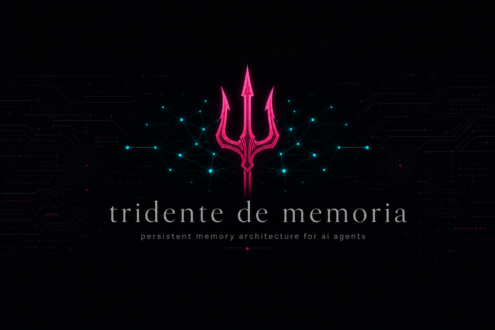
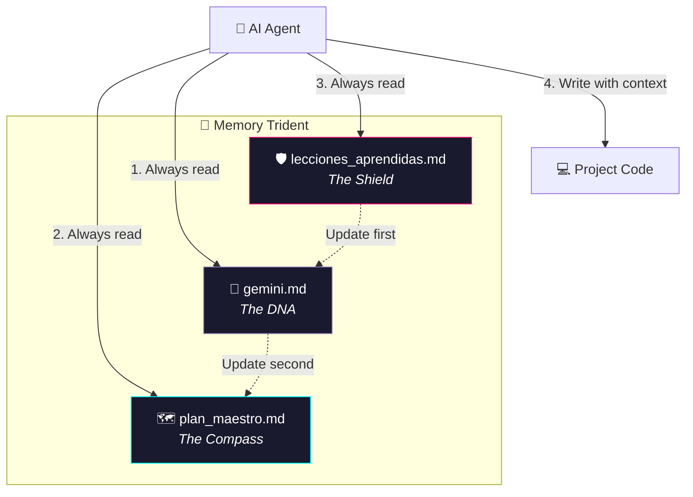

<div align="center">



<br><br>

[](https://whoami-labs.com)
[](https://github.com/Cyberdark-Security/tridente-de-memoria-skill)

# 🔱 Memory Trident

**Persistent memory architecture for AI agents**

*Turn your AI from a "code assistant" into a true Software Architect.*

[🇪🇸 Versión en español](README.md) · [Skill Documentation](SKILL.md) · [Agent Guide](AGENTS.md)

</div>

---

## Table of contents

- [The problem](#-the-problem)
- [The solution](#-the-solution)
- [Anatomy of the Trident](#-anatomy-of-the-trident)
- [Workflow](#-workflow)
- [Installation](#-installation)
- [Quick start](#-quick-start)
- [Tools](#️-automation-tools)
- [Compatibility](#-compatibility)

---

## 🎯 The problem

AI-assisted development suffers from a critical flaw: **context loss**.

Every new session, model switch, or chat restart forces the agent to "guess" the architecture, rules, and already-fixed bugs. The result: inconsistent code, regressions, and hallucinations.

<div align="center">

> *"No agent will ever write a single line of code blindly. Ever."*

</div>

---

## 💡 The solution

The **Memory Trident** is a protocol of 3 interconnected markdown files that act as the project's **external brain**. The agent reads before acting, documents before forgetting, and syncs before diverging.

| Feature | What it does |
| :--- | :--- |
| 🛡️ **Anti-hallucination** | Forces reading rules and architecture before touching code |
| ⚙️ **Phase Zero** | Initial interview that generates the 3 files with real context |
| 📚 **Continuous learning** | Every solved bug is documented for the future agent |
| 🔗 **Total sync** | The 3 files update in strict order, as a single organism |

---

## 🏗️ Anatomy of the Trident



<table>
<tr>
<td width="33%" valign="top">

### 🧬 `gemini.md`
**The DNA**

Identity, tech stack, and **non-negotiable rules**. The project's constitution.

</td>
<td width="33%" valign="top">

### 🗺️ `plan_maestro.md`
**The Compass**

Roadmap, active sprints, tasks, and **decision log**.

</td>
<td width="33%" valign="top">

### 🛡️ `lecciones_aprendidas.md`
**The Shield**

Active mines, historical bugs, and technical traps. **Never fall twice.**

</td>
</tr>
</table>

---

## 🔄 Workflow

### The sacred update order

When something changes in the project, files are updated in this order:

1. **`lecciones_aprendidas.md`** — Document the bug or technical lesson
2. **`gemini.md`** — Only if global rules or the stack change
3. **`plan_maestro.md`** — Mark tasks complete and record the decision

---

## 📦 Installation

**Option A — Install as Skill (recommended)**

```bash
git clone https://github.com/Cyberdark-Security/tridente-de-memoria-skill.git
```

| Platform | Installation path |
| :--- | :--- |
| **Cursor** | `~/.cursor/skills/` or `~/.agents/skills/` |
| **Gemini CLI** | `~/.gemini/config/skills/` |
| **Claude Code** | `~/.claude/skills/` |

Activate in your next chat:

> *"Start a new project using the Memory Trident"*

**Option B — Quick install via AI**

> *"Install this skill: https://github.com/Cyberdark-Security/tridente-de-memoria-skill"*

**Option C — Project only**

Copy `AGENTS.md` to your project root. Compatible agents will read it automatically.

---

## ⚡ Quick start

**Windows (PowerShell)**

```powershell
.\init-tridente.ps1
```

**Linux / macOS / WSL (Bash)**

```bash
chmod +x init-tridente.sh
./init-tridente.sh
```

---

## 🛠️ Automation tools

| File | Purpose |
| :--- | :--- |
| `init-tridente.ps1` | Interactive setup for Windows |
| `init-tridente.sh` | Interactive setup for Unix |
| `templates/` | Base templates for the 3 master files |
| `SKILL.md` | Full protocol for autonomous agents |
| `AGENTS.md` | Operating instructions (copy to projects) |

---

## 🌐 Compatibility

Works with any AI agent that can read project markdown files: **Cursor**, **Gemini**, **Claude**, **ChatGPT**, **Copilot**, **Jules**, **Devin**, and others.

---

<div align="center">

Built by **[Cyberdark](https://github.com/Cyberdark-Security)** for **[Whoami Labs](https://whoami-labs.com)**

**"Empowering development with Artificial Intelligence"**

</div>
