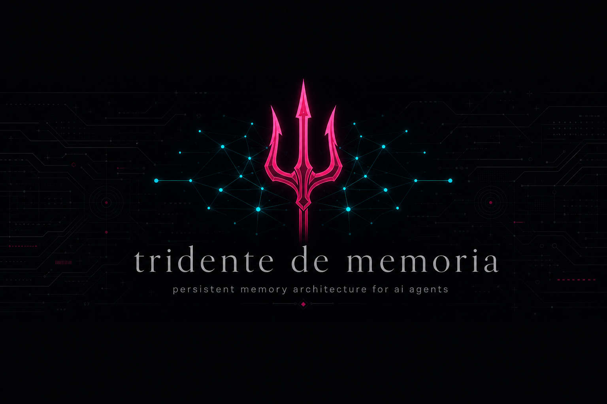
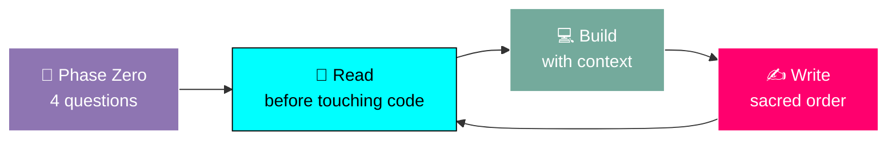

<div align="center">



<br><br>

[](https://whoami-labs.com)
[](https://github.com/Cyberdark-Security/tridente-de-memoria-skill)
[](LICENSE)

# 🔱 Memory Trident

**Persistent memory for AI agents. Three markdown files. Nothing else.**

[🇪🇸 Español](README.md) · [Protocol](docs/AGENTS.en.md) · [Skill](SKILL.md) · [Changelog](CHANGELOG.md)

</div>

---

## The problem

Every new session, every model switch, every chat restart: the agent starts
blind. It guesses the architecture again, skips the project's rules and
reintroduces bugs you already paid for once.

## The solution

Three markdown files at the project root, which the agent reads before writing
code and updates when it is done.

| File | Role | Contents |
| :--- | :--- | :--- |
| `gemini.md` | 🧬 The DNA | Identity, tech stack, non-negotiable rules and architecture. |
| `plan_maestro.md` | 🗺️ The Compass | Roadmap, current milestone, active sprint, backlog and decision log. |
| `lecciones_aprendidas.md` | 🛡️ The Shield | Active landmines, historical bugs and technical traps already paid for. |

A fourth file, `AGENTS.md`, holds the protocol: it is what the agent reads to
learn that the other three exist and how to use them.

---

## The cycle


```mermaid
flowchart LR
    A["🚀 Phase Zero<br/>4 questions"] --> B["📖 Read<br/>before touching code"]
    B --> C["💻 Build<br/>with context"]
    C --> D["✍️ Write<br/>sacred order"]
    D --> B

    style A fill:#8E75B2,stroke:#fff,color:#fff
    style B fill:#00FFFF,stroke:#000,color:#000
    style C fill:#74aa9c,stroke:#fff,color:#fff
    style D fill:#FF006E,stroke:#fff,color:#fff
```

**Read** — `gemini.md` → `plan_maestro.md` → `lecciones_aprendidas.md`

**Write** — `lecciones_aprendidas.md` → `gemini.md` → `plan_maestro.md`

The lesson goes first because pain is documented while it is hot. The plan goes
last because it references the other two.

All dates in **YYYY-MM-DD** (ISO 8601): sorts alphabetically, unambiguous
across locales.

---

## Install

### The easy way: let your AI install it

Open your project in Claude Code, Codex, Cursor, Antigravity or whichever agent
you use, and paste this:

> Install the Memory Trident in this project following
> https://raw.githubusercontent.com/Cyberdark-Security/tridente-de-memoria-skill/main/docs/AGENTS.en.md
> — ask me the Phase Zero questions one at a time.

It asks four questions about your project and writes the files. Nothing to
download, no script to run, no terminal to open.

### The manual way

Copy [`AGENTS.md`](AGENTS.md) to your project root. That's it. Most agents —
Codex, Cursor, Copilot, Jules, Devin, OpenHands, Antigravity — read it with no
configuration.

If you use Claude Code, add a one-line `CLAUDE.md`:

```markdown
@AGENTS.md
```

Then ask your agent: *"start the Trident in this project"*.

### What it looks like

See [`EJEMPLO.md`](EJEMPLO.md): a project with the three files already lived in —
decisions taken, bugs documented, one active landmine.

### As a permanent skill

```bash
git clone https://github.com/Cyberdark-Security/tridente-de-memoria-skill \
  ~/.claude/skills/tridente-de-memoria
```

Paths for other tools in [`SKILL.md`](SKILL.md). The directory must be named
`tridente-de-memoria`.

---

## What is in this repository

| Path | What it is |
| :--- | :--- |
| [`AGENTS.md`](AGENTS.md) | The protocol, in Spanish. The authority; everything else points here. |
| [`docs/AGENTS.en.md`](docs/AGENTS.en.md) | The protocol in English. |
| [`templates/`](templates/) | The three templates with `{{...}}` tokens. |
| [`EJEMPLO.md`](EJEMPLO.md) | What a real project looks like with the Trident in place. |
| [`SKILL.md`](SKILL.md) | Manifest for installing it as a skill. |
| [`CLAUDE.md`](CLAUDE.md) | Six-line pointer for Claude Code. |

Plain markdown. No dependencies, no build, no scripts.

> The master files keep their Spanish names and section headings: they are the
> canonical names the protocol looks for. Write their contents in whatever
> language your team uses.

### The rule that keeps this small

This repository went through a phase where the scaffolding weighed twenty times
more than the product: a generator, a scored validator, fourteen tool pointers,
two installers and 1,475 lines of tests. All of it was deleted in v3.0.0
([changelog](CHANGELOG.md)).

Before adding anything here, the question is: **does the person using the
Trident need this, or only the person maintaining the repository?** If it is the
second, it does not go in.

---

<div align="center">

<br>

Built by **[Cyberdark](https://github.com/Cyberdark-Security)** for **[Whoami Labs](https://whoami-labs.com)**

*"AI amplifies knowledge by 1000%, where the limit is your own mind."*
— **Cyberdark**

<br>

[](https://github.com/Cyberdark-Security/tridente-de-memoria-skill)

</div>
